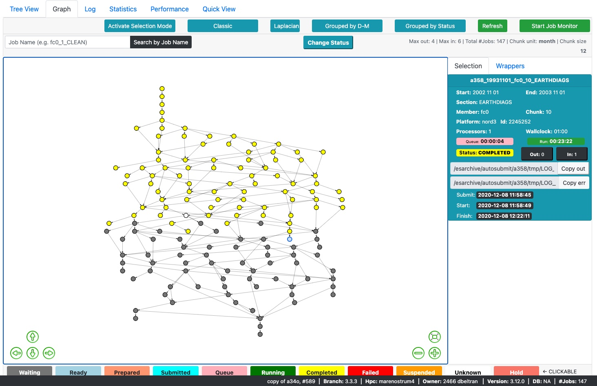

# Summary

`Autosubmit GUI` is a front-end software developed using **Javascript** and **ReactJS** that aims to provide users with complex
information from the workflow execution of scientific experiments (managed by `Autosubmit`) in any system, but mainly **High-Performance Computing (HPC)** platforms.
`Autosubmit` [@autosubmit] is a Python-based workflow manager able to handle complex tasks involving different sub-steps (e.g., scientific computational experiments). Tasks are executed in one or multiple computing systems (platforms), from High-Performance Computers to small clusters or workstations. This workflow manager can orchestrate the tasks (jobs) that constitute the workflow while respecting their dependencies and handling errors.

This front-end software consumes information served by an API (`Autosubmit API` [@api]) that collects data from the execution of experiment workflows. An experiment consists of jobs that are executed on the selected platform and that follow some established inter-dependencies. The execution of an experiment and its jobs may generate a high amount of information that needs to be processed so users can visualize it. `Autosubmit API` summarizes this information and presents it as API requests. `Autosubmit GUI` consumes these API requests and shows the information available in a condensed, comprehensive, and dynamic way. `Autosubmit GUI` uses three highly popular and useful libraries: `FancyTree` [@fancytree], `vis.js` [@visjs], and `react-google-charts` [@reactgoogle]; among other web resources that facilitate the visualization of information and information updates.

The visual approach to experiment workflow management is not new in the High-Performance Computing scenario. As two widely adopted tools, we have Cylc [@cylc] and ecFlow [@ecflow]. `Autosubmit GUI` attempts to present a development template for those willing to work in a web environment for progress monitoring purposes.

# Statement of need

The number of jobs in an experiment workflow (managed by `Autosubmit`) ranges from one to several thousand. The jobs can vary in the kind of task they perform, from data retrieval to complex climate simulations. The result of the execution of an experiment workflow is usually large amounts of information scattered in a file system.
Access to this information is possible through the file system or by using terminal commands (provided by `Autosubmit`) to get the data as a `text` or `pdf` file or terminal output. Although they fulfilled the purpose of experiment monitoring, these ways of presenting workflow information fell short once the experiments grew in the number of jobs involved and dependencies. Therefore, our users needed a more optimal, accessible, and interactive technology to access their experiments' results. The development team chose a web architecture as the solution that would enable us to quickly deploy this service and with minimum requirements for our users. Furthermore, this choice would allow developers to reuse existing technology, in the form of open-source visualization libraries, to let `Autosubmit GUI` show information in a graphical way. Since the amount of information we need to show is considerable, the software has been designed and developed with an emphasis on optimization and maintaining little loading times.

The primary experiment workflow representation generated by the users of `Autosubmit` was a graph generated through graphviz in a `pdf` file. Consequently, that was the first representation we tried to mimic in `Autosubmit GUI`. For this purpose, we chose `vis.js`, a proven Javascript library that implements graph representations for the provided data. This library also provides a rich API through which we can manipulate it and dynamically update it. In our implementation, we present several ways to access the `vis.js` objects and adapt them to our necessities in concordance with the requirements of `ReactJS`. We avoid unnecessary refreshes of the graph component by storing it in the `React` internal state. We believe that our implementation can guide those willing to work with graph representations in a web environment.

Later, `Autosubmit GUI` was required to implement an experiment workflow representation that showed more information at first glance, arranging jobs hierarchically. As a result, we decided to implement a tree view based on `FancyTree`, a `Javascript` library. This library provides a rich API that allowed us to implement a structured visualization of the experiment workflow. Again, we adapted this library to work smoothly with `ReactJS`. By directly accessing the internal component infrastructure, we achieved smooth updates of the tree's information. It is also an excellent example of how to use the tools provided by this library. Moreover, we use `react-google-charts` to display statistics generated by the experiment workflow execution.

Finally, we discuss a little about our programming language and framework choice. **Javascript** was the obvious, and perhaps required, selection in this respect. This programming language has taken over the web and is becoming a standard, for better or worse. For our front-end purpose, it has all the tools that we needed and gives us access to a variety of useful extensions. The central vision of `Autosubmit GUI` was to develop a graphical interface that showed as much information as possible at first glance; moreover, this interface should be scalable, with more information requirements taking an area of the browser window. We decided that the interface should be divided into modules that would be displayed in a tiled design. The interface should update the modules (tiles) individually and independently without affecting general performance. **ReactJS** provides the tools to accomplish this purpose, where we can translate our idea of modules to components. So, it was the chosen framework.

# Main features

- Users can search for experiments that match specific criteria: Currently active experiments (those being executed), experiments belonging to a particular user, description of experiments that contain a particular word, and other filters. The result is presented in a main window \autoref{fig:mainwindow} where the experiment progress is displayed for each result along with additional relevant information. Each experiment item in the result gives direct access to the experiment representation (tree view by default) or a quick view that displays only the essential information. From the experiment item, there is an option to see only a summary of the current progress of the experiment.

- User can see the representation of their experiment in three ways with some variations:
  - **Tree View** \autoref{fig:treeview}: Uses `FancyTree` to present the experiment jobs in a structured and hierarchical fashion.
  - **Graph View** \autoref{fig:graphview}: Uses `vis.js` to present the experiment jobs in a graph.
  - **Quick View**: Uses `FancyTree` to present a browsable list of the experiment jobs.

- All experiment representations allow the search of jobs by name or by patterns in the name using the `*` wildcard.
- The graph view allows the user to select some nodes (jobs) and generate a command through the `Change Status` button.
- The graph view presents variations of the representation for ease of usage.
- The graph and tree views allow the user to see detailed information of a job by clicking on the node or item.
- The tree view allows the user to select some items (jobs) and generate a command through the `Activate Selection Mode` button.
- `ACTIVE` experiments (shown at the top of the page next to the experiment identifier) can update the representation (graph or tree) according to changes in real time through the `Start Job Monitor` option. This functionality doesn't prompt a full component rerender, instead, the nodes or items are update individually and independently.
- The last lines of the log of the experiment can be visualized.
- Statistics of the workflow execution are provided through the `Statistics` tab using `react-google-charts`.
- Performance metrics of the experiment are displayed in the `Performance` tab.
- Historical data is displayed for individual jobs through a button next to the job's name in the selection tile.

<!-- # Citations -->

<!-- Work in progress -->

<!-- If you want to cite a software repository URL (e.g. something on GitHub without a preferred
citation) then you can do it with the example BibTeX entry below for @fidgit.

For a quick reference, the following citation commands can be used. -->

<!-- # Figures

Work in progress. -->

# Acknowledgements

We acknowledge contributions from Francisco Doblas-Reyes, Kim Serradell, and all our **Earth Science Department** users.

# References
